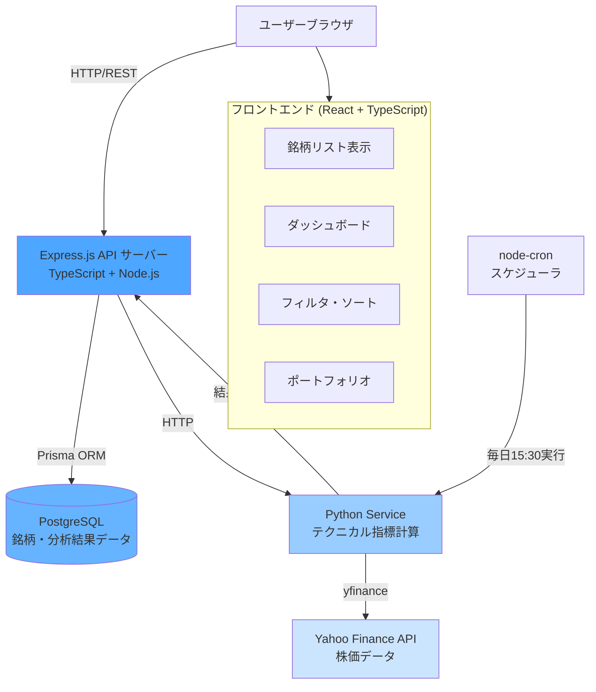

# プロジェクトタスクリスト

**最終更新：** 2025-10-30

---

## 1. プロジェクトブループリント (Project Blueprint)

- **コア目標：** ユーザーが事前に準備した銘柄リストに対して、テクニカル指標に基づいて買い/売り判断を自動出力し、投資判断を支援するWebベースのアプリケーションを提供する。
- **主要なアーキテクチャ/技術的決定：** フロントエンドはReact + TypeScript、バックエンドはNode.js + Express.js + TypeScript、データベースはPostgreSQL、テクニカル指標計算はPython（yfinance、ta-lib）で実装。レイヤード・モノリスアーキテクチャを採用。
- **プロジェクトフェーズの区分：**
  1. **フェーズ1：環境構築と基盤実装** - 開発環境セットアップ、DBスキーマ設計・実装
  2. **フェーズ2：バックエンド API 実装** - REST API構築、ビジネスロジック実装
  3. **フェーズ3：テクニカル分析エンジン実装** - Python分析エンジン、スケジューラ実装
  4. **フェーズ4：フロントエンド UI 実装** - React UI構築、API連携
  5. **フェーズ5：統合テスト・最適化・デプロイ** - E2Eテスト、最適化、本番デプロイ
- **仮定：**
  - 対象は日本株のみ（初期版）
  - データ更新は日次（終値ベース）
  - ユーザーはシングルユーザーまたは簡易認証（初期版）
  - テクニカル指標は移動平均線、RSI、MACDをベースとした確定的ロジック
  - データ取得はYahoo Finance（yfinance）を使用

---

## 2. プロジェクトアーキテクチャ図 (Project Architecture Diagram)

---

## 3. 詳細タスクリスト (Detailed Task List)

### **フェーズ 1：環境構築と基盤実装 （1-2 週間）**

#### 1-1. プロジェクト初期化とリポジトリ管理

- **T001** プロジェクトリポジトリ初期化（GitHub）
  - モジュール：基盤整備
  - 優先度：**クリティカル**
  - 推定工数：小（1-2時間）
  - 依存関係：無し
  - 内容：GitHub上にリポジトリ作成、.gitignoreの設定、プロジェクト構造のディレクトリ作成

- **T002** .env.example と環境変数テンプレート作成
  - モジュール：基盤整備
  - 優先度：**クリティカル**
  - 推定工数：小（30分）
  - 依存関係：T001
  - 内容：データベースURL、APIキー、ポート番号などの環境変数テンプレートを作成

#### 1-2. Docker環境構築

- **T003** Docker + Docker Composeセットアップ
  - モジュール：基盤整備 / インフラ
  - 優先度：**クリティカル**
  - 推定工数：中（2-3時間）
  - 依存関係：T001
  - 内容：Dockerfile、docker-compose.ymlを作成。Node.js、PostgreSQL、Pythonの各コンテナを定義

- **T004** ローカル開発環境で Docker-composeが正常に起動することを確認
  - モジュール：基盤整備
  - 優先度：**高**
  - 推定工数：小（1-2時間）
  - 依存関係：T003
  - 内容：docker-compose upコマンドで全コンテナが正常起動、通信確認

#### 1-3. バックエンド基盤構築

- **T005** Node.js + Express.js プロジェクト初期化
  - モジュール：バックエンド基盤
  - 優先度：**クリティカル**
  - 推定工数：小（1-2時間）
  - 依存関係：T003
  - 内容：npm init、必要なパッケージインストール（express、typescript、ts-node等）

- **T006** TypeScript設定（backend）
  - モジュール：バックエンド基盤
  - 優先度：**クリティカル**
  - 推定工数：小（1時間）
  - 依存関係：T005
  - 内容：tsconfig.json設定、build/startスクリプト設定

- **T007** ESLint + Prettier設定（backend）
  - モジュール：バックエンド基盤
  - 優先度：**中**
  - 推定工数：小（1時間）
  - 依存関係：T006
  - 内容：コード品質・フォーマッティング設定

- **T008** Express.js基本サーバー実装（Hello World）
  - モジュール：バックエンド基盤
  - 優先度：**高**
  - 推定工数：小（1時間）
  - 依存関係：T005, T006
  - 内容：基本的なサーバーが起動、簡単なエンドポイント確認

#### 1-4. フロントエンド基盤構築

- **T009** React + Viteプロジェクト初期化
  - モジュール：フロントエンド基盤
  - 優先度：**クリティカル**
  - 推定工数：小（1-2時間）
  - 依存関係：T003
  - 内容：npm create vite、React + TypeScriptテンプレートセットアップ

- **T010** TypeScript設定（frontend）
  - モジュール：フロントエンド基盤
  - 優先度：**クリティカル**
  - 推定工数：小（1時間）
  - 依存関係：T009
  - 内容：tsconfig.json、vite.config.ts設定

- **T011** Redux Toolkitセットアップ
  - モジュール：フロントエンド基盤
  - 優先度：**クリティカル**
  - 推定工数：中（1-2時間）
  - 依存関係：T009
  - 内容：redux、@reduxjs/toolkit、react-reduxインストール。ストア初期化。

- **T012** Material-UI + Rechartsライブラリインストール
  - モジュール：フロントエンド基盤
  - 優先度：**高**
  - 推定工数：小（30分）
  - 依存関係：T009
  - 内容：@mui/material、recharts等UIライブラリのインストール

#### 1-5. データベース基盤構築

- **T013** PostgreSQL初期化とコンテナ確認
  - モジュール：データベース基盤
  - 優先度：**クリティカル**
  - 推定工数：小（1-2時間）
  - 依存関係：T003
  - 内容：PostgreSQLコンテナ起動、接続確認、初期ユーザー・DB作成

- **T014** Prismaセットアップ
  - モジュール：データベース基盤
  - 優先度：**クリティカル**
  - 推定工数：中（1-2時間）
  - 依存関係：T005, T013
  - 内容：npx prisma init、.env設定、Prisma Client生成

- **T015** Prismaスキーマ設計・実装（stocks テーブル）
  - モジュール：データベース基盤
  - 優先度：**クリティカル**
  - 推定工数：小（1-2時間）
  - 依存関係：T014
  - 内容：prisma/schema.prismaに stocks テーブル定義

- **T016** Prismaスキーマ設計・実装（analysis_results テーブル）
  - モジュール：データベース基盤
  - 優先度：**クリティカル**
  - 推定工数：小（1-2時間）
  - 依存関係：T015
  - 内容：analysis_results テーブル定義

- **T017** Prismaスキーマ設計・実装（technical_indicators, portfolio テーブル）
  - モジュール：データベース基盤
  - 優先度：**クリティカル**
  - 推定工数：小（1-2時間）
  - 依存関係：T016
  - 内容：technical_indicators、portfolioテーブル定義

- **T018** Prismaマイグレーション実行（初期化）
  - モジュール：データベース基盤
  - 優先度：**クリティカル**
  - 推定工数：小（30分）
  - 依存関係：T017
  - 内容：npx prisma migrate dev --name init実行、DBスキーマ確認

- **T019** Prismaシードデータ（ダミー銘柄）作成（オプション）
  - モジュール：データベース基盤
  - 優先度：**中**
  - 推定工数：小（1-2時間）
  - 依存関係：T018
  - 内容：seed.ts作成、テスト用ダミー銘柄をDBに投入

---

### **フェーズ 2：バックエンド API 実装 （2-3 週間）**

#### 2-1. API基盤・ミドルウェア実装

- **T020** エラーハンドリングミドルウェア実装
  - モジュール：バックエンド-API基盤
  - 優先度：**高**
  - 推定工数：中（1-2時間）
  - 依存関係：T008
  - 内容：エラーのキャッチ、統一的なエラーレスポンス形式定義

- **T021** リクエスト検証ミドルウェア実装（joi/express-validator）
  - モジュール：バックエンド-API基盤
  - 優先度：**高**
  - 推定工数：中（1-2時間）
  - 依存関係：T008
  - 内容：入力値検証ロジック実装、バリデーションルール定義

- **T022** CORS設定
  - モジュール：バックエンド-API基盤
  - 優先度：**高**
  - 推定工数：小（30分）
  - 依存関係：T008
  - 内容：Express CORS設定、フロントエンドからのリクエスト許可設定

- **T023** ロギングミドルウェア実装（winston/pino）
  - モジュール：バックエンド-API基盤
  - 優先度：**中**
  - 推定工数：小（1-2時間）
  - 依存関係：T008
  - 内容：リクエスト・レスポンス・エラーのログ記録

#### 2-2. 銘柄管理API実装

- **T024** GET /api/stocks エンドポイント実装
  - モジュール：バックエンド-銘柄API
  - 優先度：**クリティカル**
  - 推定工数：中（2-3時間）
  - 依存関係：T018, T020
  - 内容：全銘柄取得、フィルタ・ソート対応、レスポンス形式定義

- **T025** POST /api/stocks エンドポイント実装
  - モジュール：バックエンド-銘柄API
  - 優先度：**クリティカル**
  - 推定工数：中（1-2時間）
  - 依存関係：T024, T021
  - 内容：新規銘柄追加、バリデーション、レスポンス返却

- **T026** GET /api/stocks/:id エンドポイント実装
  - モジュール：バックエンド-銘柄API
  - 優先度：**高**
  - 推定工数：小（1時間）
  - 依存関係：T024
  - 内容：銘柄詳細取得、存在しない場合のエラーハンドリング

- **T027** PUT /api/stocks/:id エンドポイント実装
  - モジュール：バックエンド-銘柄API
  - 優先度：**高**
  - 推定工数：小（1時間）
  - 依存関係：T026
  - 内容：銘柄情報更新、バリデーション

- **T028** DELETE /api/stocks/:id エンドポイント実装
  - モジュール：バックエンド-銘柄API
  - 優先度：**高**
  - 推定工数：小（1時間）
  - 依存関係：T027
  - 内容：銘柄削除、削除に伴う関連データ処理

#### 2-3. 分析結果API実装

- **T029** GET /api/analysis/:stockId エンドポイント実装
  - モジュール：バックエンド-分析API
  - 優先度：**クリティカル**
  - 推定工数：中（2時間）
  - 依存関係：T024, T020
  - 内容：特定銘柄の最新分析結果取得、テクニカル指標値を含む

- **T030** GET /api/analysis/:stockId/history エンドポイント実装
  - モジュール：バックエンド-分析API
  - 優先度：**高**
  - 推定工数：中（1-2時間）
  - 依存関係：T029
  - 内容：過去の分析履歴取得、時系列データ提供

#### 2-4. ポートフォリオAPI実装

- **T031** GET /api/portfolio エンドポイント実装
  - モジュール：バックエンド-ポートフォリオAPI
  - 優先度：**中**
  - 推定工数：小（1-2時間）
  - 依存関係：T024, T020
  - 内容：ポートフォリオ一覧取得、成績計算含む

- **T032** POST /api/portfolio エンドポイント実装
  - モジュール：バックエンド-ポートフォリオAPI
  - 優先度：**中**
  - 推定工数：小（1-2時間）
  - 依存関係：T031
  - 内容：ポートフォリオエントリ追加

- **T033** PUT /api/portfolio/:id、DELETE /api/portfolio/:id エンドポイント実装
  - モジュール：バックエンド-ポートフォリオAPI
  - 優先度：**中**
  - 推定工数：小（1-2時間）
  - 依存関係：T032
  - 内容：ポートフォリオエントリ更新・削除

#### 2-5. テスト・ドキュメント

- **T034** APIユニットテスト実装（Jest + Supertest）
  - モジュール：バックエンド-テスト
  - 優先度：**高**
  - 推定工数：大（3-4時間）
  - 依存関係：T024-T033
  - 内容：全APIエンドポイントのテストケース作成、正常系・異常系カバー

- **T035** API統合テスト実装
  - モジュール：バックエンド-テスト
  - 優先度：**高**
  - 推定工数：中（2-3時間）
  - 依存関係：T034
  - 内容：複数エンドポイント間の連携テスト

- **T036** Swagger/OpenAPI APIドキュメント作成
  - モジュール：バックエンド-ドキュメント
  - 優先度：**中**
  - 推定工数：中（2時間）
  - 依存関係：T024-T033
  - 内容：API仕様書自動生成、Swagger UIセットアップ

---

### **フェーズ 3：テクニカル分析エンジン実装 （1-2 週間）**

#### 3-1. Python環境構築

- **T037** Python 3.11環境セットアップ（Docker / ローカル）
  - モジュール：分析エンジン-基盤
  - 優先度：**クリティカル**
  - 推定工数：小（1-2時間）
  - 依存関係：T003
  - 内容：Python venv/Dockerでの環境構築

- **T038** 必要なPythonパッケージインストール（yfinance、ta-lib、pandas等）
  - モジュール：分析エンジン-基盤
  - 優先度：**クリティカル**
  - 推定工数：中（1-2時間）
  - 依存関係：T037
  - 内容：requirements.txt作成、全パッケージインストール

#### 3-2. テクニカル指標計算実装

- **T039** 移動平均線（MA）計算関数実装
  - モジュール：分析エンジン-指標計算
  - 優先度：**クリティカル**
  - 推定工数：小（1-2時間）
  - 依存関係：T038
  - 内容：MA5、MA20、MA50計算ロジック実装

- **T040** RSI計算関数実装
  - モジュール：分析エンジン-指標計算
  - 優先度：**クリティカル**
  - 推定工数：小（1-2時間）
  - 依存関係：T038
  - 内容：相対力指数（RSI）計算ロジック実装

- **T041** MACD計算関数実装
  - モジュール：分析エンジン-指標計算
  - 優先度：**クリティカル**
  - 推定工数：小（1-2時間）
  - 依存関係：T038
  - 内容：MACD値、シグナルライン、ヒストグラム計算実装

#### 3-3. 買い/売り判定ロジック実装

- **T042** 買い/売り判定アルゴリズム実装
  - モジュール：分析エンジン-判定ロジック
  - 優先度：**クリティカル**
  - 推定工数：中（2-3時間）
  - 依存関係：T039, T040, T041
  - 内容：複数指標の重み付け、スコア算出、判定ルール実装

- **T043** バックテスト実装（過去1年データでの検証）
  - モジュール：分析エンジン-検証
  - 優先度：**高**
  - 推定工数：大（3-4時間）
  - 依存関係：T042
  - 内容：過去データでの判定精度検証、勝率計算

#### 3-4. 外部データ取得・連携

- **T044** yfinanceを使用した株価データ取得関数実装
  - モジュール：分析エンジン-データ取得
  - 優先度：**クリティカル**
  - 推定工数：小（1-2時間）
  - 依存関係：T038
  - 内容：日本株（.T）のデータ取得、エラーハンドリング

- **T045** Express.js APIとの連携実装（REST API経由で結果送信）
  - モジュール：分析エンジン-連携
  - 優先度：**高**
  - 推定工数：中（1-2時間）
  - 依存関係：T024, T044
  - 内容：Python分析結果をバックエンド APIに送信するロジック

#### 3-5. スケジューラ実装

- **T046** 手動更新用API エンドポイント実装（POST /api/analyze）
  - モジュール：分析エンジン-API
  - 優先度：**クリティカル**
  - 推定工数：中（2-3時間）
  - 依存関係：T024, T045
  - 内容：ユーザーが UI からボタンをクリックして分析実行できるエンドポイント実装

- **T047** 手動更新時のエラーハンドリング・リトライロジック実装
  - モジュール：分析エンジン-エラーハンドリング
  - 優先度：**高**
  - 推定工数：中（1-2時間）
  - 依存関係：T046
  - 内容：API 失敗時の自動リトライ、エラーメッセージ返却

#### 3-6. テスト

- **T048** Python分析エンジンのユニットテスト（pytest）
  - モジュール：分析エンジン-テスト
  - 優先度：**高**
  - 推定工数：中（2-3時間）
  - 依存関係：T042
  - 内容：指標計算関数、判定ロジックのテストケース

---

### **フェーズ 4：フロントエンド UI 実装 （2-3 週間）**

#### 4-1. ページ・レイアウト構築

- **T049** メインレイアウト・ナビゲーション実装
  - モジュール：フロントエンド-UI基盤
  - 優先度：**クリティカル**
  - 推定工数：中（2-3時間）
  - 依存関係：T012
  - 内容：ヘッダー、サイドバー、メインコンテンツエリア構築

- **T050** ホームページ（銘柄一覧）画面実装
  - モジュール：フロントエンド-画面
  - 優先度：**クリティカル**
  - 推定工数：大（3-4時間）
  - 依存関係：T049, T024
  - 内容：銘柄テーブル表示、買い/売り判定表示、最新スコア表示

- **T051** 銘柄詳細・ダッシュボード画面実装
  - モジュール：フロントエンド-画面
  - 優先度：**クリティカル**
  - 推定工数：大（3-4時間）
  - 依存関係：T050, T029
  - 内容：テクニカル指標詳細表示、チャート表示、買い/売り根拠表示

- **T052** ポートフォリオ追跡画面実装
  - モジュール：フロントエンド-画面
  - 優先度：**高**
  - 推定工数：中（2-3時間）
  - 依存関係：T031
  - 内容：保有銘柄管理、成績記録、履歴表示

#### 4-2. 機能実装（フィルタ・ソート等）

- **T053** フィルタパネル実装（買い推奨のみ表示等）
  - モジュール：フロントエンド-機能
  - 優先度：**高**
  - 推定工数：中（2-3時間）
  - 依存関係：T050
  - 内容：信号でのフィルタ、スコア範囲でのフィルタUI実装

- **T054** ソート機能実装（スコア順、信頼度順等）
  - モジュール：フロントエンド-機能
  - 優先度：**高**
  - 推定工数：小（1-2時間）
  - 依存関係：T050
  - 内容：複数列でのソート機能実装

- **T055** ページネーション実装
  - モジュール：フロントエンド-機能
  - 優先度：**中**
  - 推定工数：小（1-2時間）
  - 依存関係：T050
  - 内容：大量銘柄表示時のページ分割

#### 4-3. チャート・データ表示

- **T056** テクニカル指標チャートコンポーネント実装（Recharts）
  - モジュール：フロントエンド-チャート
  - 優先度：**高**
  - 推定工数：中（2-3時間）
  - 依存関係：T012, T051
  - 内容：移動平均線、RSI、MACDのチャート表示

- **T057** 時系列データ（過去30日の判定推移）グラフ実装
  - モジュール：フロントエンド-チャート
  - 優先度：**中**
  - 推定工数：中（2時間）
  - 依存関係：T030, T056
  - 内容：過去の判定推移をグラフで表示

#### 4-4. 状態管理・API連携

- **T058** Redux Storeにstocksスライス実装
  - モジュール：フロントエンド-状態管理
  - 優先度：**クリティカル**
  - 推定工数：中（1-2時間）
  - 依存関係：T011
  - 内容：銘柄データ取得・キャッシュ、フィルタ状態管理

- **T059** Redux Storeにanalysisスライス実装
  - モジュール：フロントエンド-状態管理
  - 優先度：**クリティカル**
  - 推定工数：小（1-2時間）
  - 依存関係：T011
  - 内容：分析結果データ管理

- **T060** APIサービス層実装（Axios経由のAPI呼び出し）
  - モジュール：フロントエンド-API連携
  - 優先度：**クリティカル**
  - 推定工数：中（2-3時間）
  - 依存関係：T024-T033
  - 内容：全APIエンドポイントのラッパー関数実装、エラーハンドリング

#### 4-5. テスト・最適化

- **T061** フロントエンドユニットテスト実装（Jest + React Testing Library）
  - モジュール：フロントエンド-テスト
  - 優先度：**高**
  - 推定工数：大（3-4時間）
  - 依存関係：T050-T057
  - 内容：コンポーネント、Redux、APIサービスのテスト

- **T062** パフォーマンス最適化（コード分割、遅延読み込み）
  - モジュール：フロントエンド-最適化
  - 優先度：**中**
  - 推定工数：中（2-3時間）
  - 依存関係：T061
  - 内容：React.memo、useMemo、Code Splittingの適用

---

### **フェーズ 5：統合テスト・最適化・デプロイ （1-2 週間）**

#### 5-1. 統合テスト

- **T063** E2Eテスト実装（Cypress / Playwright）
  - モジュール：テスト-E2E
  - 優先度：**高**
  - 推定工数：大（4-5時間）
  - 依存関係：T034, T061
  - 内容：ユーザーフロー全体のテスト（銘柄表示 → 詳細確認 → ポートフォリオ追加等）

- **T064** APIとUIの統合動作確認
  - モジュール：テスト-統合
  - 優先度：**高**
  - 推定工数：中（2-3時間）
  - 依存関係：T063
  - 内容：バックエンド・分析エンジン・フロントエンド間の通信確認

#### 5-2. 性能最適化

- **T065** バックエンド APIレスポンス時間最適化
  - モジュール：最適化-バックエンド
  - 優先度：**高**
  - 推定工数：中（2-3時間）
  - 依存関係：T034
  - 内容：DBクエリ最適化、インデックス追加、キャッシング検討

- **T066** フロントエンドバンドルサイズ最適化
  - モジュール：最適化-フロントエンド
  - 優先度：**高**
  - 推定工数：中（2-3時間）
  - 依存関係：T062
  - 内容：tree-shaking、不要なライブラリ削除、CDN活用検討

- **T067** データベースインデックス最適化
  - モジュール：最適化-DB
  - 優先度：**中**
  - 推定工数：中（1-2時間）
  - 依存関係：T065
  - 内容：クエリプラン確認、必要なインデックス追加

#### 5-3. セキュリティ

- **T068** OWASP Top 10セキュリティチェック
  - モジュール：セキュリティ
  - 優先度：**高**
  - 推定工数：大（3-4時間）
  - 依存関係：T034, T036
  - 内容：SQLインジェクション、XSS、CSRF、認証・認可の確認

- **T069** SSL証明書設定（本番環境用）
  - モジュール：セキュリティ-インフラ
  - 優先度：**高**
  - 推定工数：小（1-2時間）
  - 依存関係：無し
  - 内容：HTTPS設定、自己署名または Let's Encrypt証明書

#### 5-4. ドキュメント

- **T070** ユーザーガイド作成
  - モジュール：ドキュメント
  - 優先度：**中**
  - 推定工数：中（2-3時間）
  - 依存関係：T050-T057
  - 内容：機能説明、操作ガイド、FAQ等

- **T071** 開発者ガイド・セットアップ手順作成
  - モジュール：ドキュメント
  - 優先度：**中**
  - 推定工数：中（2-3時間）
  - 依存関係：T003, T036
  - 内容：ローカル環境セットアップ、アーキテクチャ説明、拡張方法

#### 5-5. デプロイメント準備

- **T072** デプロイメント環境変数設定
  - モジュール：デプロイ
  - 優先度：**高**
  - 推定工数：小（1-2時間）
  - 依存関係：T002
  - 内容：本番用 .env 設定、シークレット管理

- **T073** CI/CDパイプライン設定（GitHub Actions）
  - モジュール：デプロイ-CI/CD
  - 優先度：**高**
  - 推定工数：中（2-3時間）
  - 依存関係：T001, T034, T061
  - 内容：自動テスト、ビルド、デプロイ自動化

- **T074** 本番DBマイグレーション計画・実行
  - モジュール：デプロイ-DB
  - 優先度：**クリティカル**
  - 推定工数：中（1-2時間）
  - 依存関係：T018
  - 内容：本番環境でのスキーマ適用、ダウンタイム最小化

- **T075** 本番環境へのデプロイ（Heroku / AWS等）
  - モジュール：デプロイ
  - 優先度：**クリティカル**
  - 推定工数：中（2-3時間）
  - 依存関係：T072, T073, T074
  - 内容：フロントエンド・バックエンド・Python分析エンジンのデプロイ

- **T076** 本番環境での動作確認・リグレッションテスト
  - モジュール：テスト-本番
  - 優先度：**高**
  - 推定工数：中（2-3時間）
  - 依存関係：T075
  - 内容：本番環境で全機能動作確認

#### 5-6. 運用・監視

- **T077** 監視・アラート設定（CPU、メモリ、DB等）
  - モジュール：運用
  - 優先度：**中**
  - 推定工数：中（1-2時間）
  - 依存関係：T075
  - 内容：CloudWatch、Datadog等での監視設定

- **T078** ログ集約・分析設定
  - モジュール：運用
  - 優先度：**中**
  - 推定工数：小（1-2時間）
  - 依存関係：T023
  - 内容：ログ送信先設定、ダッシュボード構築

---

## 4. タスク依存関係マトリックス

| フェーズ | 主要マイルストーン | 依存関係 | 予定期間 |
|---------|----------------|--------|---------|
| 1 | Docker環境・DB準備完了 | 無し | 1週間 |
| 2 | バックエンドAPI完全実装・テスト完了 | フェーズ1 | 2-3週間 |
| 3 | 分析エンジン・スケジューラ動作確認 | フェーズ1、2 | 1-2週間 |
| 4 | フロントエンドUI完成・API連携確認 | フェーズ2 | 2-3週間 |
| 5 | 統合テスト完了・本番デプロイ | フェーズ1-4 | 1-2週間 |

**全体予定工期：** 7-11週間（約2-3ヶ月）

---

## 5. リスクと対策

| リスク項目 | 影響度 | 対策 |
|----------|------|------|
| yfinance APIの変更・廃止 | 中 | 国内証券会社 API への切り替え候補リスト準備 |
| テクニカル指標の精度不足 | 高 | 早期バックテスト実施、機械学習への将来移行検討 |
| DB スケーラビリティ不足 | 中 | 初期版はシングルサーバー、将来レプリケーション導入 |
| セキュリティ脆弱性発見 | 高 | 定期的な脆弱性スキャン、依存ライブラリ更新 |
| スケジューラの実行失敗 | 中 | リトライロジック、エラーアラート設定 |

---

## 6. 成功基準

- [ ] フェーズ1完了時：Docker環境で全コンテナが起動、DBスキーマ確認
- [ ] フェーズ2完了時：APIテストカバレッジ80%以上、Swaggerドキュメント完成
- [ ] フェーズ3完了時：バックテスト勝率50%以上、スケジューラ動作確認
- [ ] フェーズ4完了時：E2Eテスト成功、UIレスポンス時間 < 1秒
- [ ] フェーズ5完了時：本番環境で無障害運用、監視・アラート動作確認
